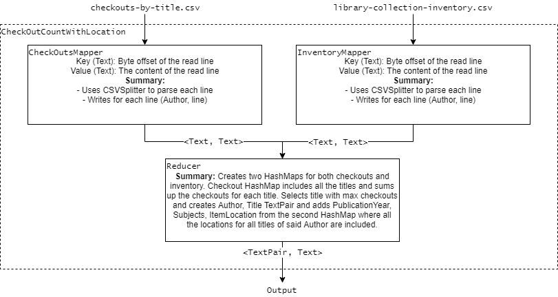
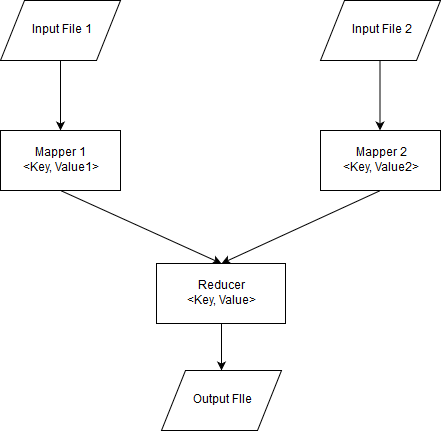
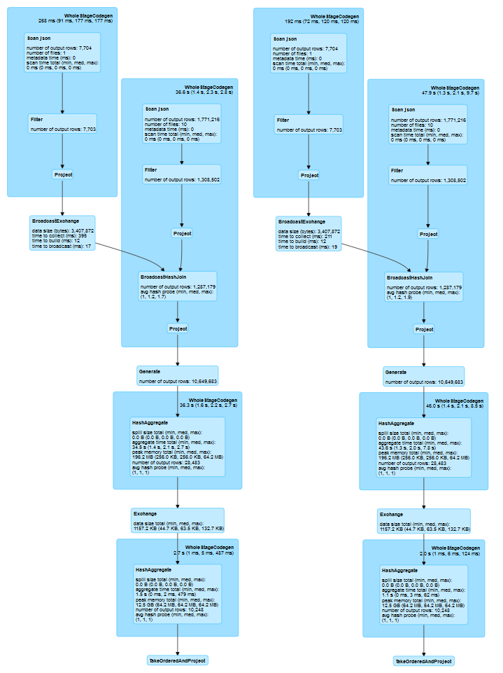

```{r setup, include=FALSE}
knitr::opts_chunk$set(echo = TRUE)
knitr::opts_chunk$set(fig.pos = 'h')
```

## Exercise 1 (MapReduce) [4 Punkte]

**a)** First of all, we take the input and map the author to the row in the `checkouts-by-title.csv` file. After that most of the heavy lifting takes place in the reducer, where a hashmap of all the titles of the current creator is created and for each value in our values list the number of checkouts is updated for the corresponding title. After having iterated all the values, the title with the maximum amount of checkouts is written out with it's corresponding author.

Statistics:

- replication rate = ???
- input size = 6789 Mbyte
- output = 27 Mbyte

```{r, out.width = "300px", echo = FALSE, fig.align = 'center', fig.cap = "\\label{fig:figs}Diagram of the Map Reduce job to solve Task A"}

```

**b)** For this task we used the MultipleInputs class. It allows you to create MapReduce jobs with multiple mapper functions, each for a different input file. The results of the mappers is then sent to the same reducer function. For the two datasets we've created two separate mappers which send the row with the author as key to the reducer. The reducer then creates two HashMaps, for both checkouts and inventory. Checkout HashMap includes all the titles and sums up the checkouts for each title. After that it selects the title with max checkouts and creates Author, Title TextPair and adds PublicationYear, Subjects, ItemLocation from the second HashMap where all the locations for all titles of said Author are stored.

Statistics:

- replication rate = ???
- input = 13944 Mbyte
- output = 36 Mbyte

```{r, out.width = "450px", echo = FALSE, fig.align = 'center', fig.cap = "\\label{fig:figs}Diagram of the Map Reduce job to solve Task B"}

```

\newpage

## Exercise 2 (Costs of MapReduce) [1 Punkte]

**a)** In the Reducer, if not using a combiner, there is some skew to be expected, given that different keys can receive different amounts of values, resulting in different processing times. Key A can have many values, for example, but key B can have very few or none, resulting in more calculation for key A values and therefore more processing time. This is till dependent on the `key,value` data distribution, because in the extreme case where all of your values are of the same key, the number of reducers doesn't matter. In this case a custom partitioner might make more sense.

**b)** Considering a small number of reducers, more randomized key values are expected at different reducers and a more even distribution of one key's intensive processing values. This also leads to less parellesim and may take longer. If the number of reducers is increased, the likelihood that only one reducer will end up with a <key, value> pair where many values are also higher. Therefore, the skewedness is increased to a very important level. On the other hand, a maximum of parallelism is achieved, but the problem of overhead computing comes with this.

**c)** If we use a combiner in the WordCount MapReduce program then we'd have less reducer calculation and more for mapping phase, basically we'd calculate sum of word occurrences for each mapper node in a document. And we don't expect to be a significant skew because reducer would have less work to do. The best way to avoid skewing would be to use combiner and partition where we determine which task reduction receives which key and its values list, to partition the key we could use a hash function and this would ensure that all pairs with the same key go to the same reducer.

**d)** Communication costs are made by the size of the input file, the sum of the sizes of all files passed from the map process to reduce processes and the sum of the output sizes of reducer processes, so basically it does not depend on the number of reducers we have, because even if we have 1 reducer or if we have 100000 reducers, we would still have the same size of the input file. We'd still have the same file size input, the same sum of all file sizes passed from map to reduce, and the sum of all reducer outputs.

\newpage

## Exercise 3 (Relational Operations) [2 Punkte]

```{r, out.width = "300px", echo = FALSE, fig.align = 'center', fig.cap = "\\label{fig:figs}Mapreduce Sketch for Bag Union and Difference"}

```

**a)** Bag Union Pseudo-code:
```{r, eval = FALSE}
sum = 0
foreach val:value 
	sum = sum + 1
context.write(Key, sum)
```
First we get all values from the same key in reducer, then we iterate through each value and increment sum variable, then we simply write to output key and sum as value.

**b)** Bag Difference Pseudo-code:
```{r, eval = FALSE}
first group by table origin and seperate them in diffrent vales : value 1 and 
value 2 corresponding to input file 1 and input file 2
sum_value1 = 0
sum_value2 = 0
foreach val: value 1
	sum_value1 = sum_value1 + 1
foreach val: value 2
	sum_value2 = sum_value2 + 1

if sum_value1 >= sum_value2
	context.write(Key, sum_value1 - sum_value2)
	
First we group by table origin, then sum up values into two different variables sum_value1
and sum_value2, then we substract these values if value is positive, 
we write to output else just skip that Key

dif = 0
foreach val:value 
	sum = sum + 1
context.write(Key, sum)
```

\newpage

## Exercise 4 (Hive Exercise) [4 Punkte]
**a)**
For task A we have to create tables and populate them with data given in CSV files. So first we create the table, we tell that values are seperated by comma and then give the location of CSV file.
```
CREATE EXTERNAL TABLE IF NOT EXISTS group11.badges (
id INT,class STRING, date DATE, name STRING, tagbased STRING, userid INT)
ROW FORMAT DELIMITED
FIELDS TERMINATED BY ','
STORED AS TEXTFILE
LOCATION '/home/adbs/2019S/shared/hive/badges.csv';
```

**b)**
Placeholder

**c)**
Because Hive does not support subqueries and also does not support unequal semi join we have to replace EXISTS with JOIN and then filter the condition in where clause.
And for count we place it in a table and for filtering also call it in WHERE clause.
```
SELECT p.id
FROM comments c, badges_tmp b, 
posts p JOIN postlinks pl ON pl.postid = p.id,
users u, (SELECT COUNT(upvotes) as nrupvotes FROM users) k
WHERE c.postid=p.id 
AND u.upvotes + 3 >= k.nrupvotes
AND u.id=p.owneruserid 
AND pl.relatedpostid > p.id
AND u.creationdate = c.creationdate  
AND u.id = b.userid 
AND (b.name LIKE 'Autobiographer');
```

\newpage

## Exercise 5 (Spark in Scala) [4 Punkte]

**b)**

```{r, out.width = "300px", echo = FALSE, fig.align = 'center', fig.cap = "\\label{fig:figs}LEFT: SQL DAG Diagram. RIGHT: Dataframe API DAG Diagram"}

```

```{r, out.width = "300px", echo = FALSE, fig.align = 'center', fig.cap = "\\label{fig:figs}LEFT: SQL DAG Diagram. RIGHT: Dataframe API DAG Diagram"}

```

```{r, out.width = "300px", echo = FALSE, fig.align = 'center', fig.cap = "\\label{fig:figs}LEFT: SQL DAG Diagram. RIGHT: Dataframe API DAG Diagram"}

```

```{r, out.width = "300px", echo = FALSE, fig.align = 'center', fig.cap = "\\label{fig:figs}LEFT: SQL DAG Diagram. RIGHT: Dataframe API DAG Diagram"}

```

```{r, out.width = "300px", echo = FALSE, fig.align = 'center', fig.cap = "\\label{fig:figs}LEFT: SQL DAG Diagram. RIGHT: Dataframe API DAG Diagram"}

```

```{r, out.width = "300px", echo = FALSE, fig.align = 'center', fig.cap = "\\label{fig:figs}Query Duration Comparison"}

```

**c)**
Placeholder